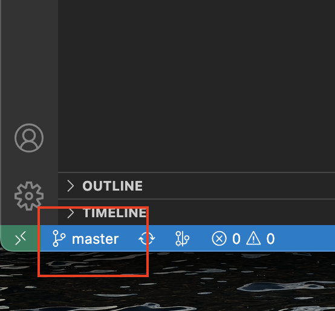
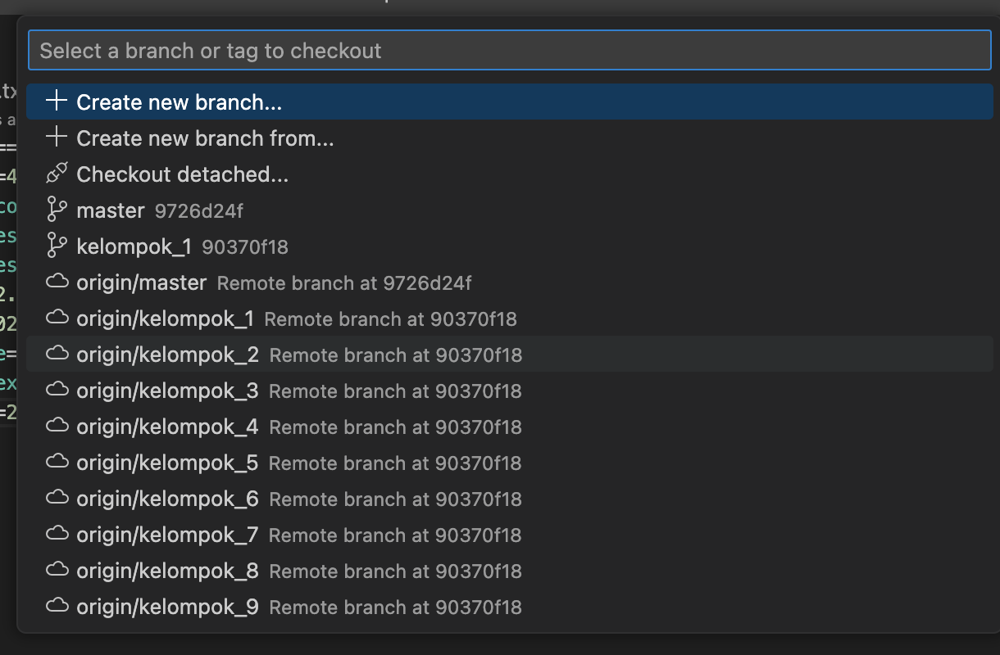

# Cara Clone dan Install
1. Clone Repository ini menggunakan vscode / yang kalian tahu.
2. Pilih branch sesuai kelompok kalian.
3. Jalankan command `pip install -r requirements.txt`
4. Buat virtual environment dengan jalankan command `python -m venv myenv`
5. Aktifkan environment: `source myenv/bin/activate` (Linux/macOS) atau
`myenv\Scripts\activate` (Windows)
6. Jalankan `python manage.py runserver`

## Cara pilih branch
1. Pada VS Code kalian, klik tombol dibawah disebelah kiri bawah

2. Pilih branch sesuai kelompok kalian

